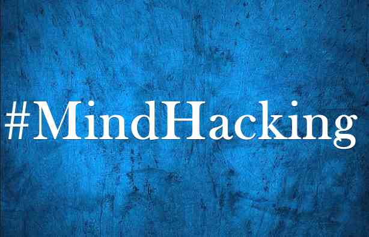
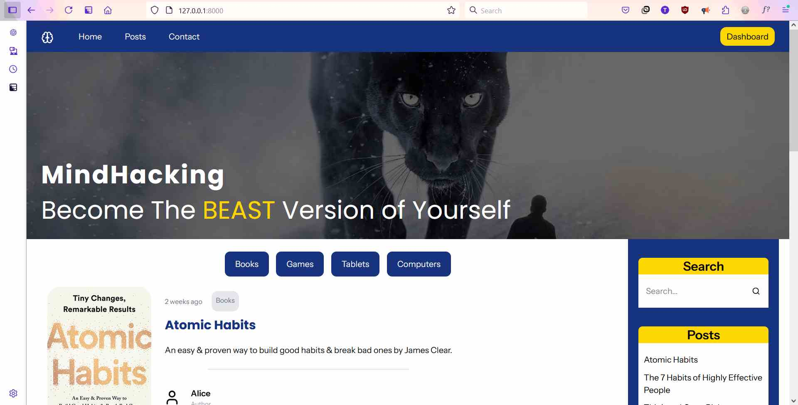
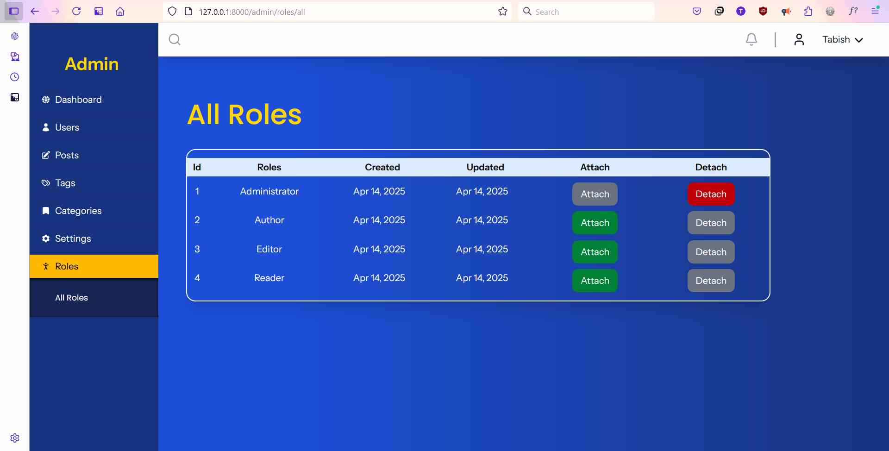

# MindHacking

A Personal blog created with Laravel + Inertia + React + Typescript

---

---

| Features          | Description                                                                            |
| ----------------- | -------------------------------------------------------------------------------------- |
| Posts             | Post can be inserted from admin panel using rich text box along with category and tags |
| Post Category     | Arrange post by category                                                               |
| Post Tags         | Create and manage tags                                                                 |
| Image             | Add image to your posts                                                                |
| Website mangement | Admin can view dashboard containing no. of posts, users, categories, and tags          |
| Users             | View and manage users from admin panel                                                 |
| Roles             | Attach and Detach roles to users                                                       |
| Contact           | Send Contact message                                                                   |

# Screenshot

Below are some screenshots

